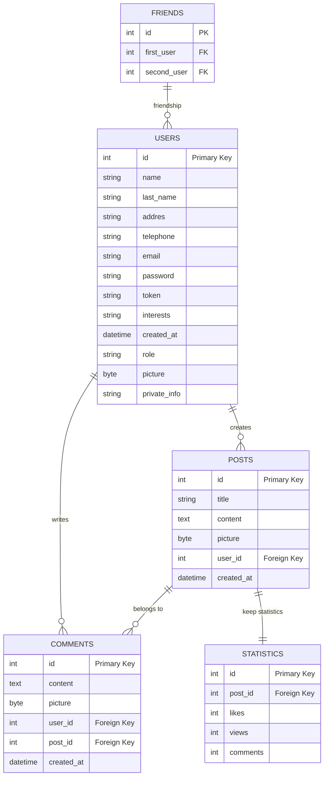

```mermaid
erDiagram
    USERS {
        int id "Primary Key"
        string name
        string last_name
        string addres
        string telephone
        string email
        string password
        string token
        string interests
        datetime created_at
        string role
        byte picture
        string private_info
    }

    FRIENDS {
        int id PK
        int first_user FK
        int second_user FK
    }

    POSTS {
        int id "Primary Key"
        string title
        text content
        byte picture
        int user_id "Foreign Key"
        datetime created_at
    }

    USERS ||--o{ POSTS : "creates"

    COMMENTS {
        int id "Primary Key"
        text content
        byte picture
        int user_id "Foreign Key"
        int post_id "Foreign Key"
        datetime created_at
    }

    STATISTICS {
        int id "Primary Key"
        int post_id "Foreign Key"
        int likes
        int views
        int comments
    }

    USERS ||--o{ COMMENTS : "writes"
    POSTS ||--o{ COMMENTS : "belongs to"
    POSTS ||--|| STATISTICS : "keep statistics"
    FRIENDS ||--}o USERS : "friendship"
```